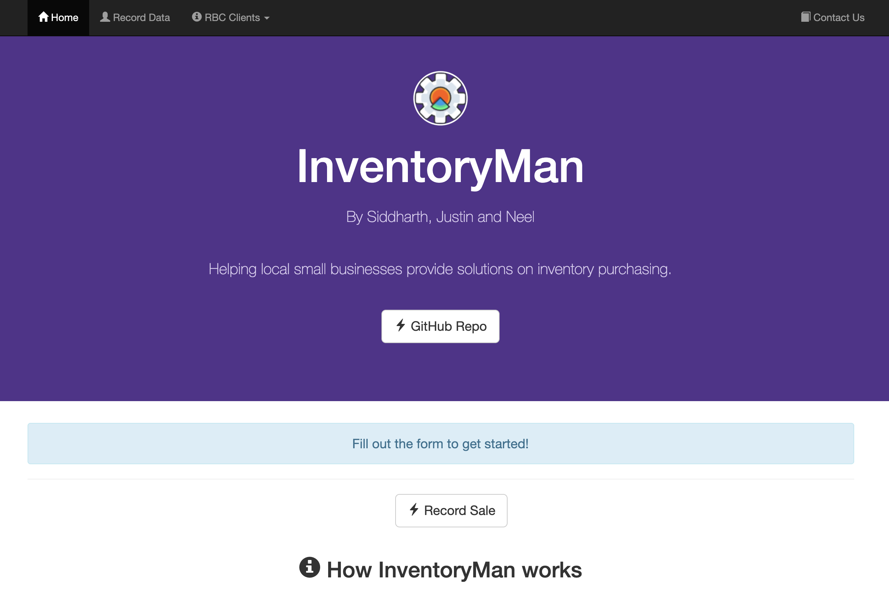
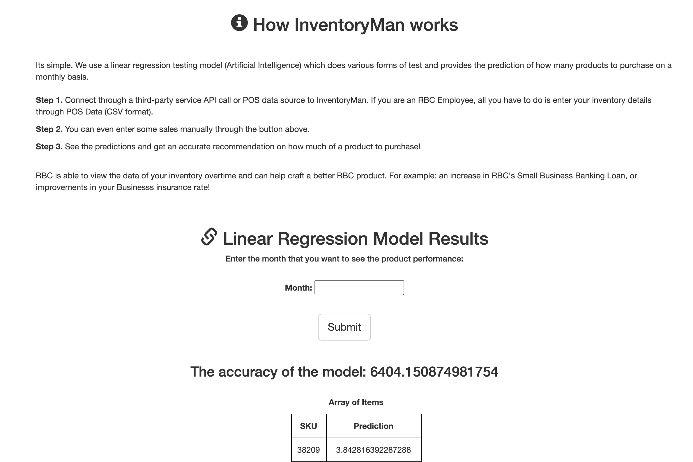
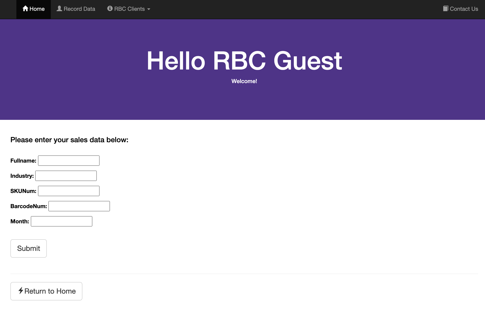
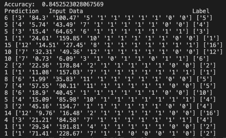

# inventorymgt - AmpHacks 2020

## Description
This web application uses linear regression testing model (Artificial Intelligence) which does various forms of test and provides the prediction of how many products to purchase on a monthly basis whilst connecting to a backend DB.

## Tools and Technology
* Full-stack Web Framework used: Django 🐍💻😏
* Machine Learning Model: Linear Regression 📈
* Database: Relational DB System (SQLite) 🔃 🔧

## Authors
* Justin Tran, Siddharth Pathak, Neel Bhavsar

## Images

##            ------------------------------------------------------------------------

##            ------------------------------------------------------------------------

##            ------------------------------------------------------------------------

